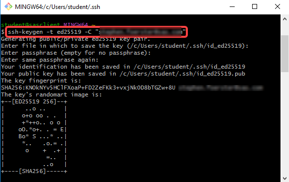
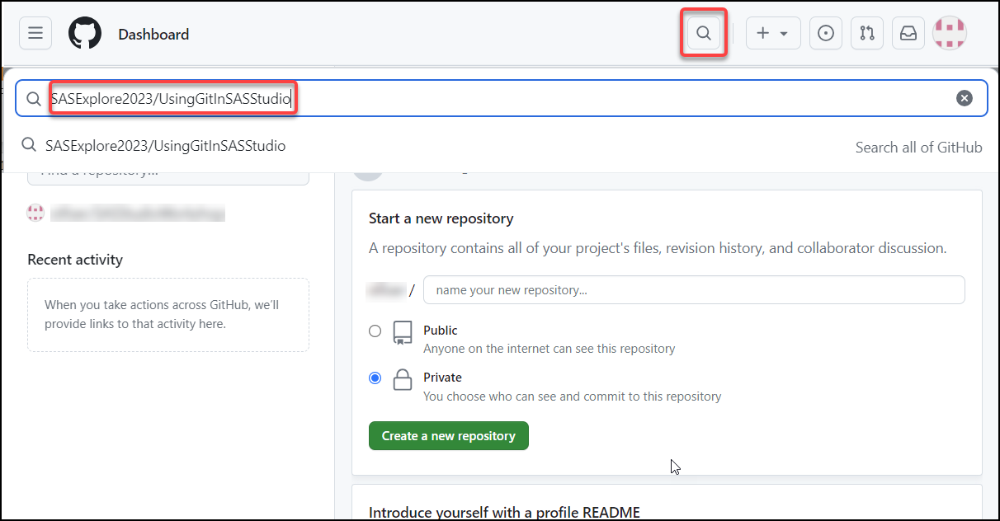
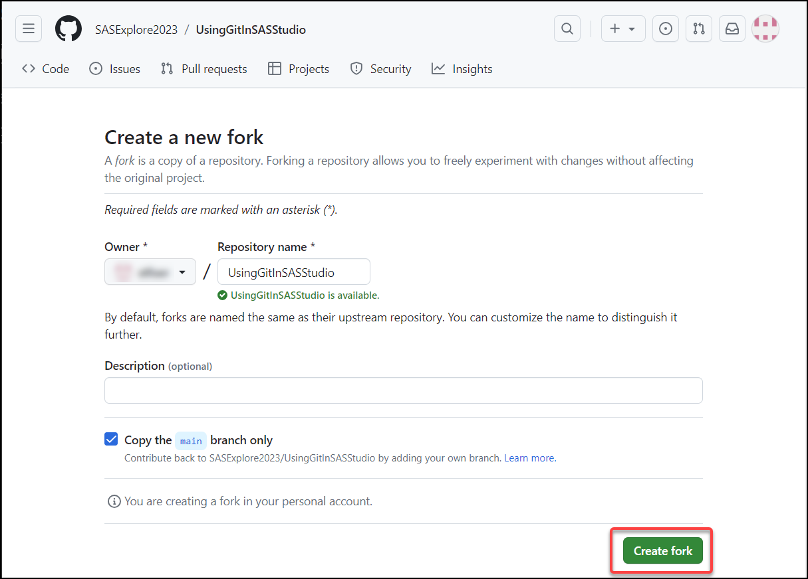
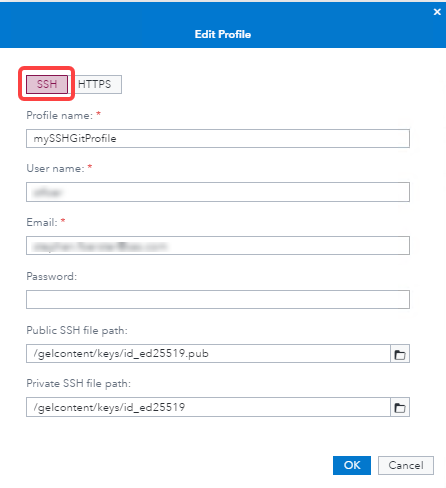
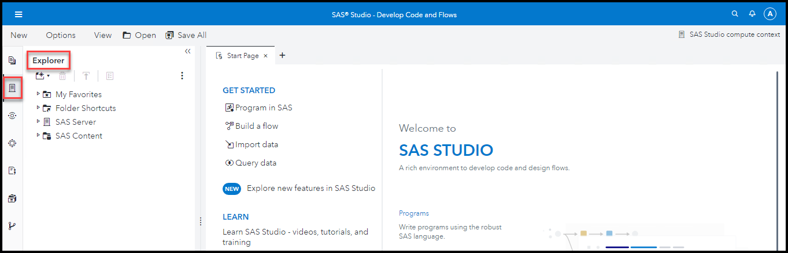

# 1. SAS Studio - Git Integration Setup with SSH

 

## Exercise Description
In this exercise, you will setup the integration between a GITHub repository and SAS Studio using SSH.

 

## Create New SSH Keys
1. On your course environment Windows desktop, click the Windows button, select **Git** and *click* the **Git Bash** icon.
   
   

2. In the git bash window, run the command **ssh-keygen -t ed25519 -C "your_email@example.com"**.
   >Make sure to replace the sample email with your real github email address.

3. You should see the similar output as shown below.  Hit **Enter** for each question the program asks.
   
    

4. The ssh-keygen program creates two files, a public key named **id_ed2519.pub**, and a private key named **id_ed2519** with no extension.

## Copy the SSH Keys to your SAS Server

1. In SAS Studio, *Right Click* the **SAS Server->Home->gelcontent->keys** directory in the Explorer  and select **Upload Files**.
   
1. Select the plus sign .
2. Navigate to the **C:\Users\Student\.ssh** directory and select the **id_ed2519.pub** and **id_ed2519** files.
3. Click **Upload**.

## Copy the Public SSH Key to your GitHub Account

1. In *Google Chrome*, navigate to **https://github.com**.
   
2. Click **Sign in** to sign in with your *GitHub* credentials.
   > &#9755; GitHub may send you a confirmation email.  Please make sure you have access to the email account you are using.
   
     > &#9755; If you do not already have *GitHub* credentials, then click **Sign Up** and follow the instructions to create them.

3. Select your account picture **&#10132; Settings**.
    

4. Select **SSH and GPG key** on the left.
5. Push the **New SSH Key** button.
6. Name your SSH Key, **myGitHubSSHKey** and copy in the contents of your **public** ssh key.
   >You can copy the contents of your public ssh key to the clipboard by returning to the git bash terminal and running **clip < ~/.ssh/id_ed25519.pub**.

   

7. Click **Add SSH Key**.

## Create a Fork of a GitHub Repository

1. In *Google Chrome*, navigate to **https://github.com**.
   
2. Click **Sign in** to sign in with your *GitHub* credentials.
   > &#9755; GitHub may send you a confirmation email.  Please make sure you have access to the email account you are using.
   
     > &#9755; If you do not already have *GitHub* credentials, then click **Sign Up** and follow the instructions to create them.
1. Enter **SASExplore2023/UsingGitInSASStudio** in the *Search* area.
    

2. Press **Enter** key to perform the search.
   
3. Select the hyperlink for the **SASExplore2023/UsingGitInSASStudio** repository.
   
4. Select **Fork &#10132; Create a new fork**.
   

5. Keep the default settings and click **Create fork**.
   
   > &#9998; This process can take a few minutes depending upon the size of the repository.

6. Once the creation of the fork is complete, then select **Code**.
   

7. On the *Local* tab, make sure **SSH** is selected, and then select  to copy the path to *clone* this fork of the repository.
   

8. Paste the URL in the *Notepad++* session to use later.
    

 
 

## Create a Git Profile in SAS Studio
1. Open the **Google Chrome** browser on your Windows RACE Image.
   
2. Select the **SAS Viya** bookmark.
   
3. Enter the following:
   - User ID: **student**
   - Password: **Metadata0**

2. Click **Sign In**.
   
3. Select  **&#10132; Develop Code and Flows** to open *SAS Studio*.
    

4. Select **Options &#10132; Manage Git Connections**.
   
5. On the *Manage Git Connections* window, select the **Profiles** tab.
   
6. Select  to add a profile.
   
   

7. Select **SSH** tab and enter the following information:
   - Profile name: **MyGitHubProfile**
   - User name: ***&lt;your GitHub user name&gt;***
    - Email: ***&lt;your GitHub primary email address&gt;***
    - Password: *&lt;Leave Blank>*
    - Public SSH file path:  **&lt;/gelcontent/keys/id_ed25519.pub>**
    - Private SSH file path:  **&lt;/gelcontent/keys/id_ed25519>**
        

    

8. Click **OK** to create the profile.
    

9.  Click **Close**.

 
 

## Create a Folder for the Local Copy of the Repository
1. Select  to view the **Explorer** tab in *SAS Studio*.
   

2. Navigate to **Files &#10132; Home** and select  **&#10132; Folder** .  Enter the name **MyGitClone**.
    > &#9998; The folder for a Git Repository must exist on the SAS Server and be an empty folder.

    

3. Select **OK** to create the folder.
   
4. Right-click the *MyGitClone* folder and select **Add shortcut**.
   
   
5. Click **OK** to create a shortcut to the folder.
   
6. Expand the **Folder Shortcuts** section to confirm the shortcut was created.
   
    

 
 

## Add Repository in SAS Studio
1. Select **Options &#10132; Manage Git Connections**.
   
2. On the *Manage Git Connections* window, select the **Repositories** tab.
   
3. Select  **&#10132; Clone a repository** to add a cloned repository.
    

4. Enter the following information:
    - Repository: ***&lt;paste saved URL for cloned (forked) Git repository&gt;***
        > &#9998; You created and saved it earlier in this exercise.
    - Server location: **/home/student/MyGitClone**
        > &#9755; Select  to navigate to **Files &#10132; Home &#10132; MyGitClone** or **Folder Shortcuts &#10132; Shortcut to MyGitClone**.

         > &#9998; This must be an empty folder location.
    - Profile: **MyGitHubProfile**.

    

5. Click **Clone** to clone the repository in the location specified.
   
6. Click **Close**.

 
 

## Review Git Repository
1. Select  to view the **Explorer** tab in *SAS Studio*.
   
2. Expand **Folder Shortcuts &#10132; Shortcut to MyGITClone** to view the contents of the cloned repository.

   

3. Select  to view the **GIT Repositories** tab in *SAS Studio*.
   
4. Double-click **MyGitClone** to open it in a tab.

    

      > &#9998; This is where you can view the staged/unstaged changes in your local repository and pull/push changes to the external Git repository.

 
 

