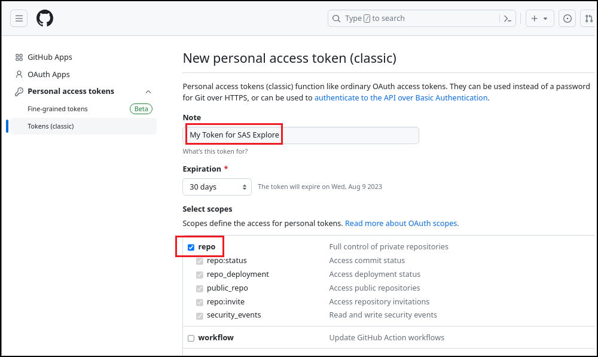
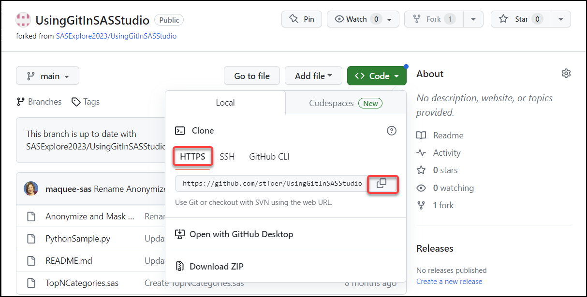
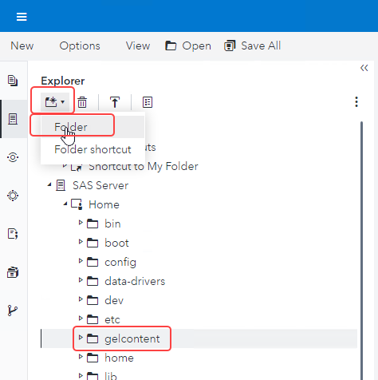
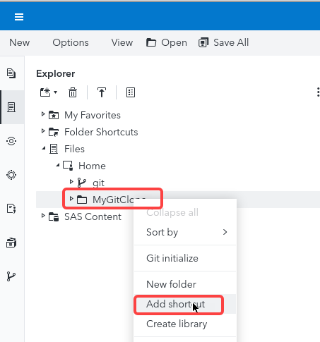

# 1. SAS Studio - Git Integration Setup

 

## Exercise Description
In this exercise, you will setup the integration between a GITHub repository and SAS Studio using HTTPS.

 

## Create Personal Access Token for GitHub
1. In *Google Chrome*, navigate to **https://github.com**.
   
2. Click **Sign in** to sign in with your *GitHub* credentials.
   > &#9755; GitHub may send you a confirmation email.  Please make sure you have access to the email account you are using.
   
     > &#9755; If you do not already have *GitHub* credentials, then click **Sign Up** and follow the instructions to create them.

3. Select your account picture **&#10132; Settings**.
    

4. Scroll down and select **<> Developer settings**.
   
5. Select **Personal access tokens &#10132; Tokens(classic)**.
    

6. Select **Generate new token &#10132; Generate new token (classic)**.
    

7. Enter the following information:
   - *Note*:  **My Token for SAS Explore**
   - *Expiration*: **30 days**
   - *Select scopes*:  **repo**  and   **user**

    
    > &#9998; **user** section is not displayed in this screenshot.

8. Scroll down and click **Generate token**.
    

9.  Select  to copy the token.
   > &#9888; Make sure to copy your personal access token now. You won’t be able to see it again!

   

10. Open *Visual Studio Code* from the *Applications* pull down menu on the desktop, create a file named **info.txt** on the desktop, paste the token in the file and save it.
    > &#9888; Keep the file open for future reference.
   

11. Return to your *GitHub* session in *Chrome*.  Select  to return to your *GitHub dashboard*.

 
 

## Confirm your Email Settings for GitHub
1. Select your account picture **&#10132; Settings**.
   
2. Select **Emails**.
   
3. Make note of your **primary email address**.
     > &#9998; You will need this for your Git Profile in SAS Studio.

4.  Ensure that the option to **Block command line pushes that expose my email** is unchecked.

1. Select  to return to your *GitHub dashboard*.

 
 

## Create a Fork of a GitHub Repository

1. Enter **SASExplore2023/UsingGitInSASStudio** in the *Search* area.
    

2. Press **Enter** key to perform the search.
   
3. Select the hyperlink for the **SASExplore2023/UsingGitInSASStudio** repository.
   
4. Select **Fork &#10132; Create a new fork**.
   

5. Keep the default settings and click **Create fork**.
   
   > &#9998; This process can take a few minutes depending upon the size of the repository.

6. Once the creation of the fork is complete, then select **Code**.
   

7. On the *Local* tab, make sure **HTTPS** is selected, and then select  to copy the path to *clone* this fork of the repository.
   

8. Paste the URL in the *Visual Studio Code* session you copied the token in.
    

 
 

## Create a Git Profile in SAS Studio
1. Open the **Google Chrome** browser on your Windows RACE Image.
   
2. Select the **SAS Viya** bookmark.
   
3. Enter the following:
   - User ID: **student**
   - Password: **Metadata0**

2. Click **Sign In**.
   
3. Select  **&#10132; Develop Code and Flows** to open *SAS Studio*.
    

4. Select **Options &#10132; Manage Git Connections**.
   
5. On the *Manage Git Connections* window, select the **Profiles** tab.
   
6. Select  to add a profile.
   
   

7. Select **HTTPS** tab and enter the following information:
   - Profile name: **MyGitHubProfile**
   - User name: ***&lt;your GitHub user name&gt;***
    - Email: ***&lt;your GitHub primary email address&gt;***
    - Password: ***&lt;paste saved Personal Access Token for GitHub&gt;***
        > &#9998; You created and saved it earlier in this exercise.

    

8. Click **OK** to create the profile.
    

9.  Click **Close**.

 
 

## Create a Folder for the Local Copy of the Repository
1. Select  to view the **Explorer** tab in *SAS Studio*.
   

2. Navigate to **Files &#10132; Home** and select  **&#10132; Folder** .  Enter the name **MyGitClone**.
    > &#9998; The folder for a Git Repository must exist on the SAS Server and be an empty folder.

    

3. Select **OK** to create the folder.
   
4. Right-click the *MyGitClone* folder and select **Add shortcut**.
   
   
5. Click **OK** to create a shortcut to the folder.
   
6. Expand the **Folder Shortcuts** section to confirm the shortcut was created.
   
    

 
 

## Add Repository in SAS Studio
1. Select **Options &#10132; Manage Git Connections**.
   
2. On the *Manage Git Connections* window, select the **Repositories** tab.
   
3. Select  **&#10132; Clone a repository** to add a cloned repository.
    

4. Enter the following information:
    - Repository: ***&lt;paste saved URL for cloned (forked) Git repository&gt;***
        > &#9998; You created and saved it earlier in this exercise.
    - Server location: **/home/student/MyGitClone**
        > &#9755; Select  to navigate to **Files &#10132; Home &#10132; MyGitClone** or **Folder Shortcuts &#10132; Shortcut to MyGitClone**.

         > &#9998; This must be an empty folder location.
    - Profile: **MyGitHubProfile**.

    

5. Click **Clone** to clone the repository in the location specified.
   
6. Click **Close**.

 
 

## Review Git Repository
1. Select  to view the **Explorer** tab in *SAS Studio*.
   
2. Expand **Folder Shortcuts &#10132; Shortcut to MyGITClone** to view the contents of the cloned repository.

   

3. Select  to view the **GIT Repositories** tab in *SAS Studio*.
   
4. Double-click **MyGitClone** to open it in a tab.

    

      > &#9998; This is where you can view the staged/unstaged changes in your local repository and pull/push changes to the external Git repository.

 
 

