# 2. SAS Studio - Work with a SAS Program from a Git Repository 

 

## Exercise Description
In this exercise, you will edit a SAS program in your local Git repository and execute it.  Then, review its output and log.  Finally, you will push the changed SAS Program to your fork of the external GitHub repository.

 

## Execute a SAS Program from your Git Repository

1. Open the **Google Chrome** browser on your Windows RACE Image.
1. Select the **SAS Viya** bookmark.
1. Enter the following:
   - User ID: **student**
   - Password: **Metdata0**

    

1. Click **Sign In**.
1. Select  **&#10132; Develop Code and Flows** to open *SAS Studio*.
1. Select  to view the **Explorer** tab in *SAS Studio*.
1. Navigate to **Folder Shortcuts &#10132; Shortcut to MyGitClone** and view its contents.
   
   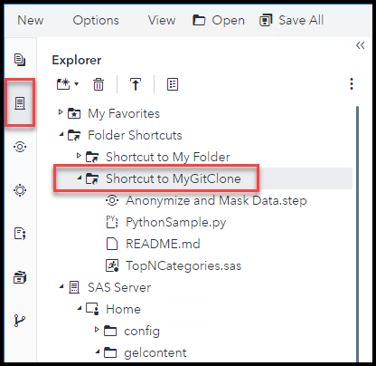
2. Double-click the *SAS Program* **TopNCategories.sas** to open the file.
    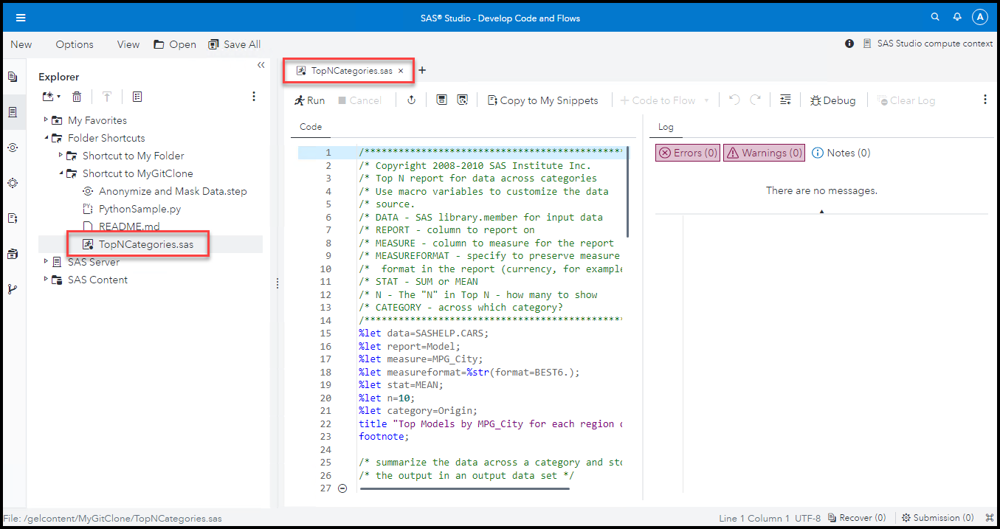
3. Click 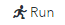 to run the program to create a report for the Top N models by MPG_City for each region of Origin.
   > &#9998; N should be set to 10.
   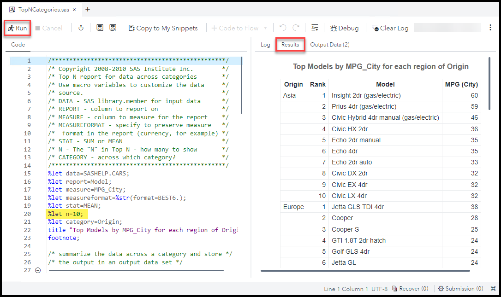
4. Select the **Log** tab to view the log for the executed program.

   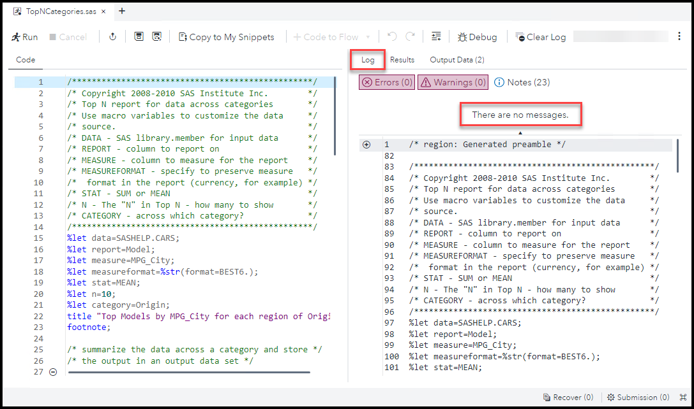

   > &#9998; There should be no errors or warnings.
5. Select **Notes** to view the notes in the log.
   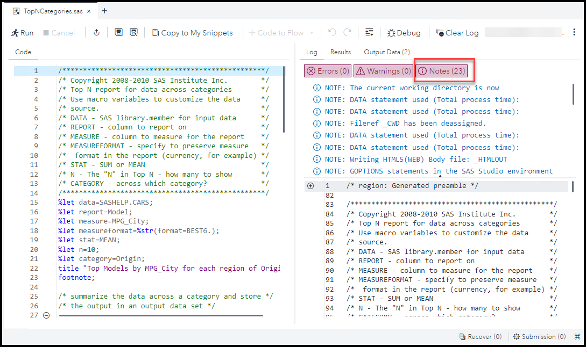
6. Select 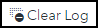 to clear the log.
   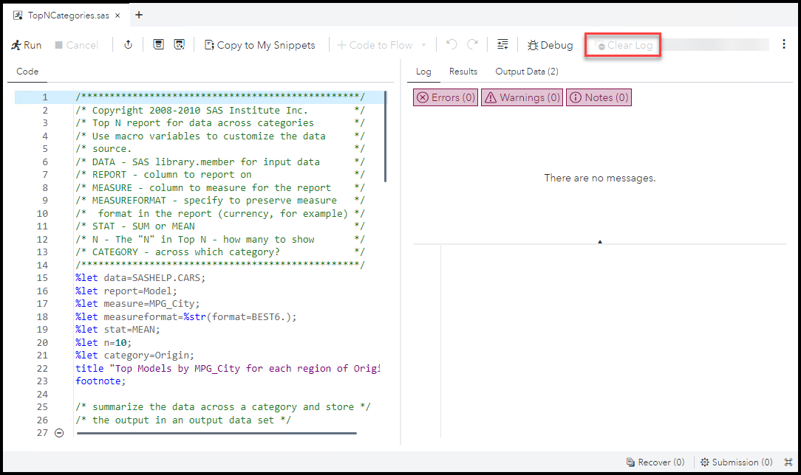

 
 

## Edit and Re-Execute the SAS Program
1. In the *TopNCategories.sas Code*, change **n** to **5**.
1. Select 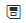 to save the change to the program.
    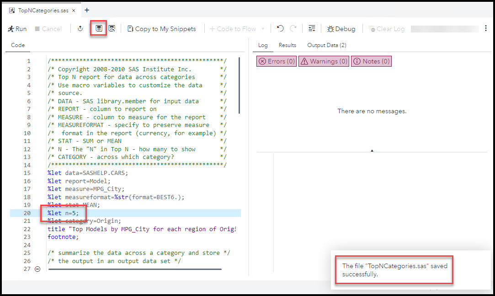
1. **Run** the program and view its results.
    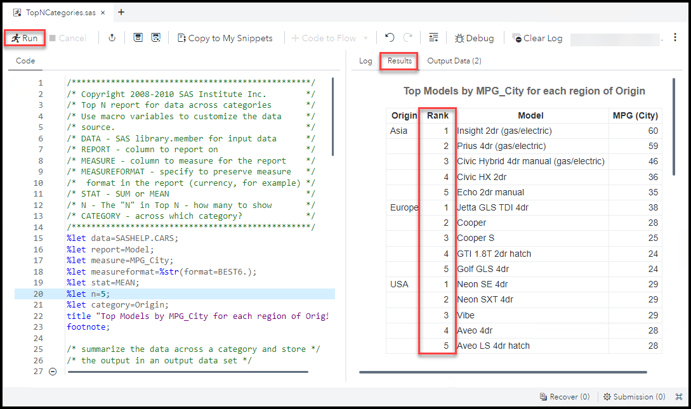

   > &#9998; The results now should be the Top 5 instead of 10.
1. Close the *TopNCategories.sas* program tab.

 
 

## Push the Changed Program to the External Git Repository
1. Select 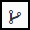 to view the **GIT Repositories** tab in *SAS Studio*.
1. Double-click **MyGitClone** to open it in a tab.
   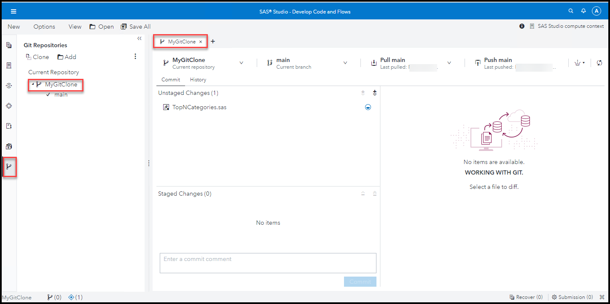
   > &#9998; The changed program is listed in the *Unstaged Changes* section.
1. Select the **TopNCategories.sas** in the *Unstaged Changes* section to view the change(s) to the file.
   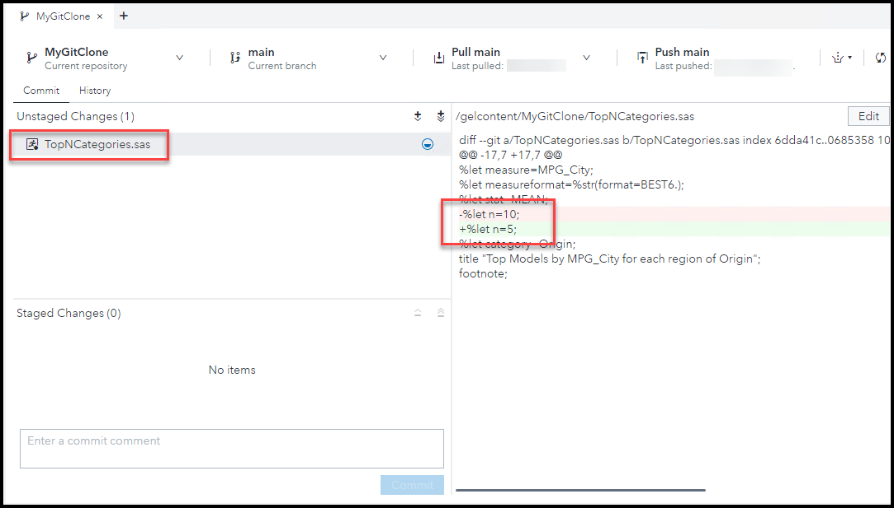
1. Select  to stage the selected file.
   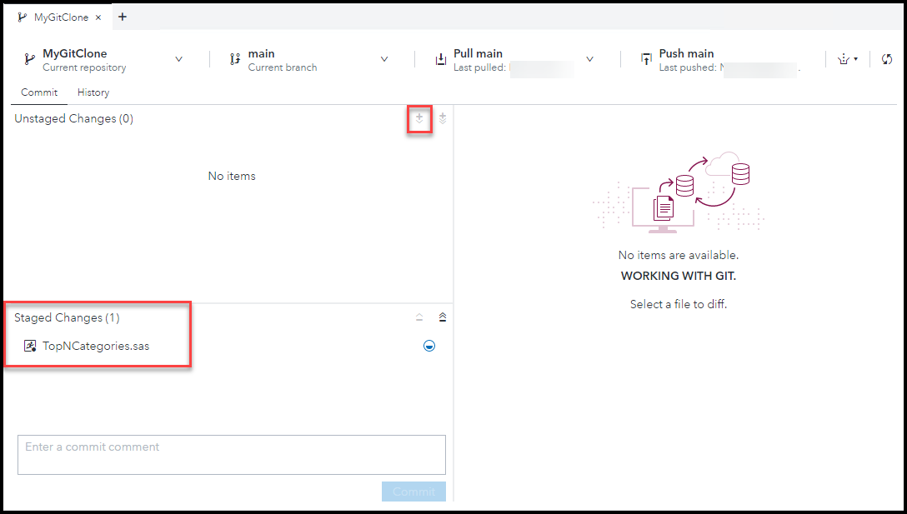
1. Select 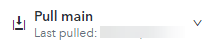 **&#10132; Pull** to pull any changes that may have happened in the main repository since you cloned it.
   > &#9998; This a good practice to do before you push any changes.

   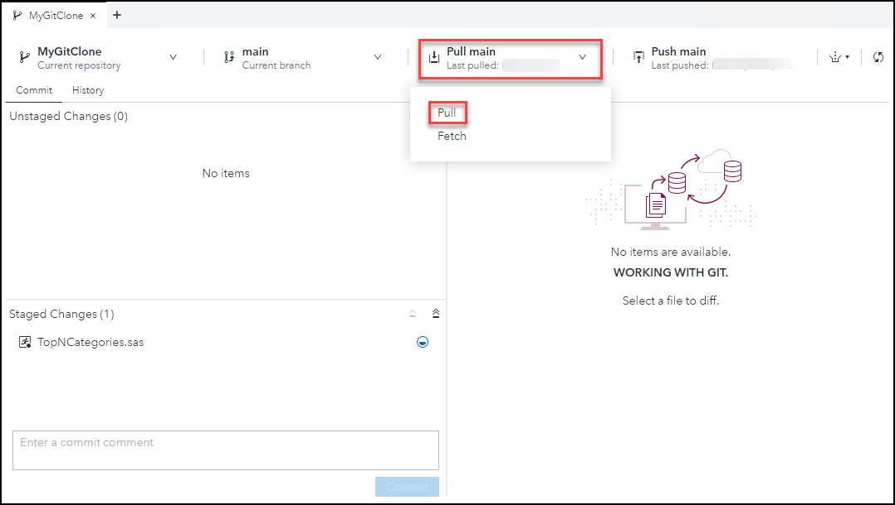

1. Enter **Changed N from 10 to 5** for the *commit comment*.
1. Select **Commit** to commit the staged change(s).
   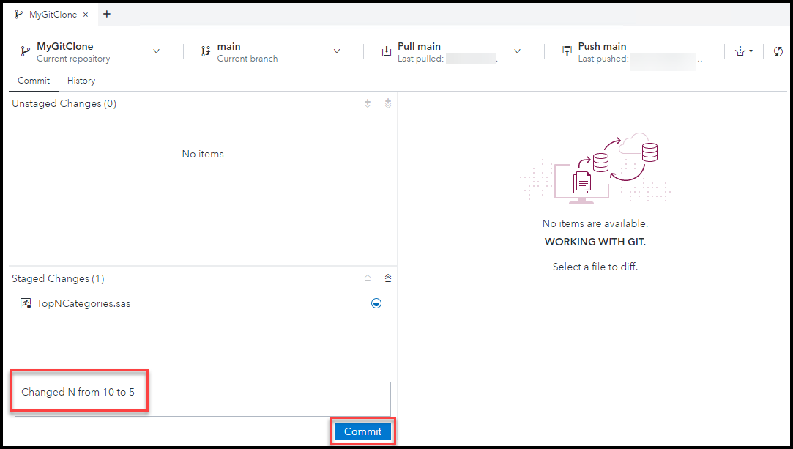
1. Select 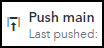 to push the committed changes to the main repository.
1. In *Google Chrome*, navigate to your Github repository to see that the change is reflected there.  You stored the github link in Visual Studio code in exercise 1.  It should look like this:  **https://github.com/<<(Your Github ID)>>/UsingGitInSASStudio**.
   
   
2. Click **Sign in** to sign in with your *GitHub* credentials.
3. The **TopNCategories.sas** file should have your commit comment listed.
   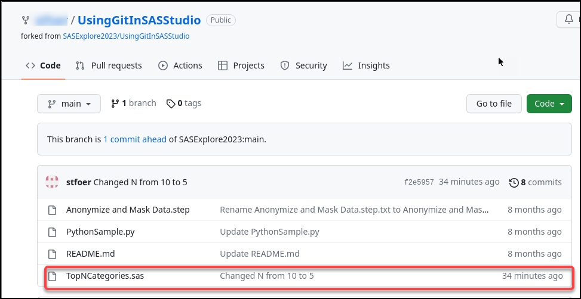

 
 
