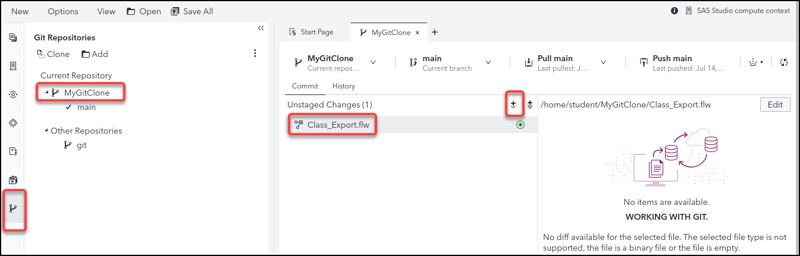
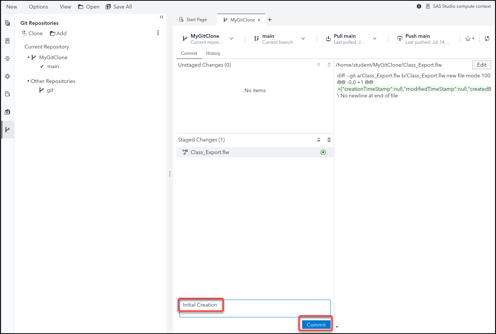

# 3. SAS Studio Flows - Push a New Flow to Git

 

## Exercise Description
In this exercise you will use SAS Studio to create a simple SAS Studio Flow and push it to GitHub.

 

## Exercise Preparation
1. Open the **Google Chrome** browser on your Windows RACE Image.
1. Select the **SAS Viya** bookmark.
1. Enter the following:
   - User ID: **student**
   - Password: **Metadata0**

    

1. Click **Sign In**.
 

## Create a Flow that writes a file from a dataset
1. Select  **&#10132; Develop Code and Flows** to open *SAS Studio*.
1. Select **New &#10132; Flow**.
1. Select  to view the **Steps** pane.

   

1. Double-click the **Table** step in the *Data (Input and Output)* section of the *Steps* pane to add it to the flow canvas.
1. In the **Table Properties** section select the following:
   - Library:  **SASHELP**
   - Table name: **CLASS**
    

1. Double click or drag the **Export** step onto the flow canvas and connect it to the **CLASS** table as shown below.
    

1. Right click the **Export** node's output port and select **Add File**.

    

1. Click on the output file icon and select its location and file name.  Navigate to **SAS Content ➔ Users ➔ Student ➔ My Folder** and name the file **class.txt**.

    

1. Select  to save the flow.

1. Navigate to Folder **Shortcuts ➔ Shortcut to MyGitClone**.

1. Enter **CLASS_Export** for the name and click <mark>**SAVE**</mark>.
   
 

 

 

## Push the Flow File to your GitHub Repository

 

1. Select  to view the **Git Repositories** in SAS Studio.

1. Double Click **MyGitClone**.

1. Click the **Class_Export.ftw** flow beneath the **Unstaged Changes (1)** heading.

2. Select  to stage the flow.

1. Note that the flow is now staged for commit.
   
1. Add the comment, "**Initial Creation**" and click <mark>**Commit**</mark>.   

1. Click the **Push main** button to push the committed flow to the repository.   

1. In *Google Chrome*, navigate to your Github repository to see that the change is reflected there.  You stored the github link in Visual Studio code in exercise 1.  It should look like this:  **https://github.com/<<(Your Github ID)>>/UsingGitInSASStudio**.
   

1. You should now see the flow added to your GitHub Repository.
    

 
 

