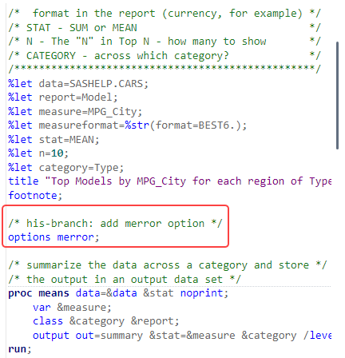

# 1. SAS Studio - Working with GIT Branches
 

## Exercise Description

In this exercise, you will work with GIT branches in SAS Studio.
 

## Exercise Preparation

1. Open the **Google Chrome** browser on your Windows RACE Image.
1. Select the **SAS Viya** bookmark.
1. Enter the following:
   - User ID: **student**
   - Password: **Metdata0**

1. Click **Sign In**.
1. Select  **&#10132; Develop Code and Flows** to open *SAS Studio*.

## Create a Branch

1. Select  to view the **GIT** tab in *SAS Studio*.
2. *Double click* the **myGitFolder** icon.
3. Select the **History** tab.
4. *Right click* on the most recent commit row and select **Create new branch**.
   >Note:  You can create a branch on any commit.  All of the changes after the commit will be ignored.

5. Name your branch **feature/T-545-report-change**.
   >Note: This is typical branch naming convention. **feature** denotes the type of branch.  Others are **bug-fix**, **release**, **hot-fix**, etc..  **T-545** denotes a task ID from **Jira**. The suffix is a description of the feature.

6. Leave the checkboxes as they are and click **Create**.

 

# Merge a Branch into Main

1. Select  to view the **Explorer** tab in *SAS Studio*.
2. *Double click* the **TopNCategories.sas** file in **myGitFolder** to open it.
3. In the program editor, change the **category** macro variable from **Origin** to **Type** in both the **%let** statement as well as the report title.
4. Save the file.
   

5. Select  to view the **GIT** tab in *SAS Studio*.
6. Select the **feature/T-545-report-change** branch
7. As you did in the earlier exercises, stage and commit the changes with the comment "Report Change".
8. Select the **History** tab and note that the feature branch is ahead of the main branch with the changes you made.
9. Switch to the main branch.
10. *Right Click* feature branch commit that is ahead of the main branch and select **Merge into main** and select the feature branch.
    
11. Note that the main and feature branch are both on the same commit now.

# Resolve a Merge Conflict

1. Select  to view the **Git** tab in *SAS Studio*.
2. Select the **History** tab.
3. Create a branch named **your-branch**.
   1. *Right click* the latest commit and select **Create New Branch**.
   2. Name the branch, **your-branch**.
   3. *Un-check" **Checkout after create** and click **Create**.
4. Create a branch named **his-branch**.
   1. *Right click* the latest commit again and select **Create New Branch**.
   2. Name this branch, **his-branch**.
   3. *Un-check" **Checkout after create** and click **Create**.
   
      
5. You should now have 4 branches, **main**, **his-branch**, **your-branch**, and your feature branch from earlier.
6. Check out **your-branch** by choosing it from the **Current branch** drop down menu.

   
7. Open the **TopNCategories.sas file** and make the following changes:
   1. Change **%let n=25;** to **%let n=15;**.
   2. Add the following comment at the bottom of the comment box: **Per User Feedback**.
   3. Add the following comment at the top of the comment block:  **your-branch**.
   
8. Save and close the program.
9. Move back to the Git  screen.
10. Stage and commit the changes to **your-branch**.
   
11. Check out **his-branch** by choosing it form the **Current branch** drop down menu.
12. Re-open the **TopNCategories.sas** program.
      >Note that the changes you made are gone.  They were committed to **your-branch** so the working directory returned to its original state.
13. This time make the following changes to the program:
    1. Change the value of **N** to **11**.
    2. Add the comment, **Per Management** at the bottom of the comment block.
    3. Add the comment, **his-branch**, in the middle of the block.
14. 
      1. Save and close the program.
      2. Return to the Git  screen.
      3. Stage and commit the changes with the comment, **his-branch commit**.
15. Check out **your-branch** by choosing it from the **Current branch** drop down menu.
16. Open the **History** tab, *right-click* **his-branch** and select **Merge into your-branch > his-branch**.
    
1. You will receive an error that there was a conflict.
  
2. Close the error.
3. Select the **Commit** tab and note that the program has an icon with two opposing arrows.  If you hover over the icon, it says **File has Conflict**.
4. *Right-click* the file and select **Edit**.
   
5. Note that the file includes both your-branch and his-branch changes.
6. If there is a conflict, you'll see both branches' content identified by branch.
   
7. Delete the **your-branch** and **his-branch** comments as well as **Per Management** one.  
8. Remove the **<<<<**, **>>>>**  and **====** lines.
9. Remove the **n=11** line.
   
10. Save and close the file.
11. Stage and Commit with the comment, **Conflict Resolved**.
12. Check the History tab to see the merge visual is complete.
    